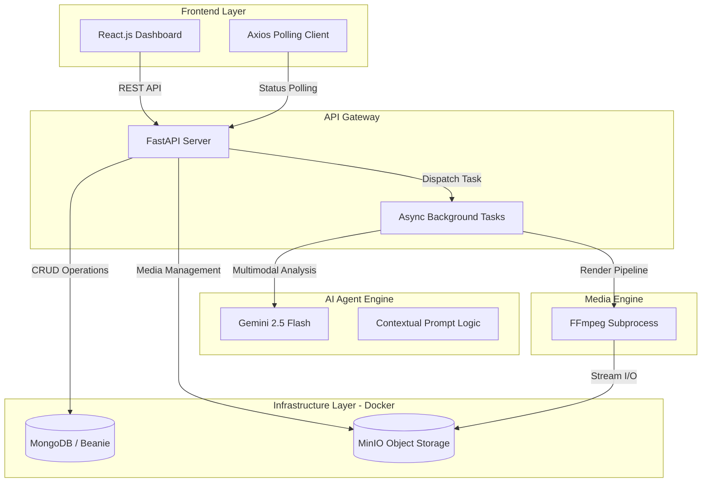
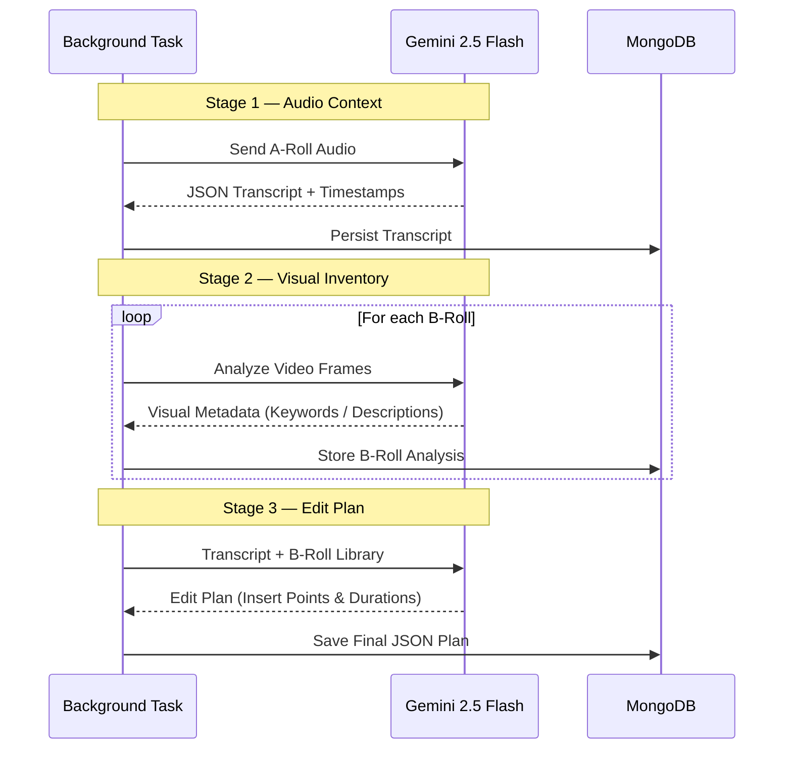

# CueSense — Context-Aware AI Video Editing

CueSense is a **professional-grade automated video editing system** designed to contextualize **A-roll content with relevant B-roll overlays** using a **multi-stage AI workflow**.It automates **transcription, visual analysis, contextual matching, and high-definition rendering**.

By leveraging multimodal Large Language Models (LLMs) and advanced video processing tools, it transforms raw footage into a contextually rich, edited video with minimal human intervention.

---

## The Core Intelligence: Multimodal Video Analysis
#### Before any rendering occurs, CueSense performs a deep semantic audit of all media assets to transform raw pixels into actionable metadata.
### 1. A-Roll Semantic Mapping

The system first processes the primary **talking-head (A-Roll)** footage to establish a linguistic and temporal baseline.

- **Temporal Transcription**  
  Gemini 2.5 Flash extracts the audio stream and generates a high-fidelity, word-level transcript with precise timestamps.

- **Theme Identification**  
  The AI identifies key topics, concepts, and named entities, mapping them to exact millisecond-level timecodes within the video.

- **Linguistic Anchoring**  
  This produces a semantic timeline that the Matching Agent uses to determine *exactly where* a B-roll insertion adds maximum contextual value for the viewer.
  

### 2. B-Roll Visual Inventory Indexing

Each uploaded **B-roll** clip undergoes a comprehensive visual analysis to determine its intent, content, and suitability.

- **Multimodal Frame Sampling**  
  The B-roll video is processed directly by Gemini 2.5 Flash, enabling the model to analyze visual frames over time.

- **Intent Analysis**  
  The vision model identifies objects, actions, camera perspective, and overall mood  
  *(e.g., “A high-angle shot of a chef chopping vegetables in a bright kitchen”)*.

- **Keyword Tagging**  
  A structured set of semantic keywords is generated  
  *(e.g., cooking, freshness, precision)* and persisted in **MongoDB** for fast retrieval during the matching and edit-planning phase.

---
## Preview


---

## System Architecture & Infrastructure

CueSense uses a **hybrid local + containerized architecture** to balance performance and reproducibility.

- **Docker** → Infrastructure services (MongoDB, MinIO)
- **Native execution** → Heavy compute (AI + FFmpeg) for direct hardware access


## ⚙️ Technical Workflow Detail

### 1️⃣ Data Ingestion & State Management

#### Object Storage
Media assets are stored in MinIO buckets:
- `arolls`
- `brolls`
- `outputs`

#### Metadata Persistence
MongoDB + Beanie ODM track:
- project state
- timestamps
- AI-generated metadata
---

### 2️⃣ Multi-Stage AI Pipeline

CueSense orchestrates multiple specialized AI stages for high contextual relevance.



## Setup & Installation
### 1. Infrastructure (Docker)
#### Initialize the database and storage services:

```
docker-compose up -d
```

### 2. Environment Configuration
#### Create a .env file in the backend root. You can use the provided .env.example as a template to ensure all required variables are present.


```
GEMINI_API_KEY=your_key_here
MINIO_ENDPOINT=localhost:9000
MONGO_URI=mongodb://localhost:27017
```
### 3. Execution

#### Backend: 
```
uvicorn app.main:app --reload
```

#### Frontend: 
```
npm install && npm start
```
